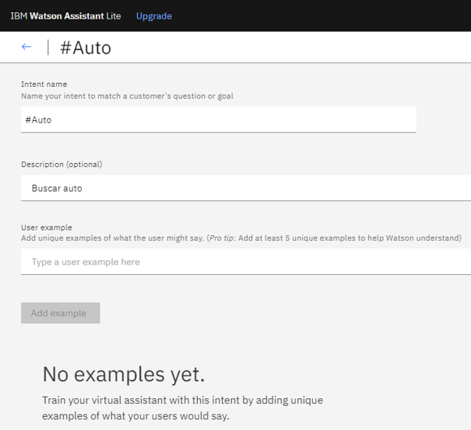

# Trabajo Extra
# Informe 
##  El desarrollo de un chatbot con IBM Watson.

## 1.PLANTEAMIENTO DEL PROBLEMA

Realizar un tutorial sobre como desarrollo de un chatbot con IBM Watson.

## 2.OBJETIVOS

### General:
Estudio de la Plataforma de IBM Watson para el Desarrollo de un ChatBot.

### Específicos:
*Investigar la plataforma IBM Watson en la construcción de un ChatBot
*Realizar un video tutorial sobre el desarrollo de un ChatBot con IBM Watson.
*Presentar la documentación del desarrollo del ChatBot.

## 3.ESTADO DEL ARTE

### Tema:Aplicaciones de inteligencia artificial en procesos de cadenas de suministros: una revisión sistemática

Gabriel A. Icarte Ahumada
Año de publicación 2016

Facultad de Ingeniería y Arquitectura. Universidad Arturo Prat. Avda. Arturo Prat #2120. Iquique, Chile. E-mail: gicarte@unap.cl

Una cadena de suministro (SC) es una red de empresas que producen, venden y entregan un producto o servicio a un segmento de mercado predeterminado. No solo incluye a los fabricantes y proveedores, sino que también a transportistas, almacenes, minoristas y los propios clientes, entre otros. Debido al avance tecnológico, específicamente en áreas como las comunicaciones, procesamiento computacional, gestión y almacenamiento de información, es posible apoyar a la administración de cadenas de suministros pudiendo hacerla mas eficiente. En este contexto, la inteligencia artificial (IA) ha sido aplicada en diferentes procesos de SC pero no hay conocimiento especifico sobre cuáles técnicas de IA están siendo aplicadas (o no) en los procesos de la SC o cuáles actividades de la SC están siendo apoyadas (o no) con técnicas de IA. Con base a lo anterior, el objetivo de este trabajo fue establecer de forma empírica el aporte de la IA en procesos de la SC, para luego establecer actividades de investigación a realizarse en el futuro. Para lograr esto, se realizó una revisión sistemática considerando el modelo SCOR como referencia para procesos de una SC. Los principales resultados indican que los algoritmos genéticos y los agentes inteligentes son las técnicas más investigadas para procesos de la SC relacionados con la planificación y, en menor medida, a procesos relacionados con la entrega de productos. Además, existe una tendencia a incluir la incertidumbre como trabajo futuro en diferentes técnicas de IA de manera que los modelos se acerquen más a la realidad (Icarte Ahumada, 2016).

### Tema:A New Chatbot for Customer Service on Social Media

Authors: 
Anbang  Xu profile imageAnbang Xu, Zhe  Liu profile imageZhe Liu, Yufan  Guo profile imageYufan Guo, Vibha Singhal Sinha profile imageVibha Sinha, Rama  Akkiraju profile imageRama Akkiraju

Publication:CHI '17: Proceedings of the 2017 CHI Conference on Human Factors in Computing SystemsMay 2017 Pages 3506–3510https://doi.org/10.1145/3025453.3025496

Los usuarios recurren rápidamente a las redes sociales para solicitar y recibir servicio al cliente; sin embargo, la mayoría de estas solicitudes no se atendieron a tiempo o ni siquiera se atendieron en absoluto. Para superar el problema, creamos un nuevo sistema de conversación para generar automáticamente respuestas a las solicitudes de los usuarios en las redes sociales. Nuestro sistema está integrado con técnicas de aprendizaje profundo de vanguardia y está capacitado por casi 1 millón de conversaciones en Twitter entre usuarios y agentes de más de 60 marcas. La evaluación revela que más del 40% de las solicitudes son emocionales, y el sistema es tan bueno como los agentes humanos en mostrar empatía para ayudar a los usuarios a afrontar situaciones emocionales. Los resultados también muestran que nuestro sistema supera al sistema de recuperación de información basado tanto en juicios humanos como en una métrica de evaluación automática (Xu et al., 2017).

## 4.MARCO TEÓRICO
### 4.1. BOT
  Qué son Bots:
  
  Bot es la palabra robot acortada. Se refiere a un tipo de programa informático autónomo que es capaz de llevar a cabo tareas concretas e imitar el comportamiento humano.
  Los bots pueden estar diseñados en cualquier lenguaje de programación. Funcionan en redes, especialmente en internet, y pueden interactuar con otros sistemas o usuarios.         Pueden realizar múltiples funciones: editar textos, moderar conversaciones, responder preguntas, enviar correos electrónicos, entre muchas otras.

  Hoy en día son usados para realizar diversas tareas en plataformas muy populares, como Youtube, Twitter, Facebook o Instagram.
  La palabra bot, como tal, se registra por primera vez en la década de los sesenta, como aféresis de robot en la jerga informática. En español la podemos escribir sin cursivas
  y sin ningún otro tipo de resalte (Significado de Bots (Qué Son, Concepto y Definición) - Significados, n.d.).
  
  
  
  ### 4.2. CHATBOT
  Un chatbot es un programa informático con el que es posible mantener una conversación, tanto si queremos pedirle algún tipo de información o que lleve a cabo una acción.

  Un ejmplo. hoy en día si uno quiere comprarse unos zapatos a través de Asos tiene que acceder a su web, encontrar lo que busca y comprarlo. Pero, ¿y si Asos tuviera un bot?     Solo sería necesario escribirle un mensaje a la marca a través de Facebook y decirle qué queremos. E incluso si tuviéramos dudas acerca de las medidas de las tallas podríamos   consultarle en un momento nuestro problema.

  Una de las grandes ventajas de los chatbots es que, a diferencia de las aplicaciones, no se descargan, no es necesario actualizarlos y no ocupan espacio en la memoria del       teléfono. Otra es que podemos tener integrados varios bots en un mismo chat. De esta forma nos evitaríamos estar saltando de una app a otra según lo que necesitemos en cada     momento. ¿Las principales consecuencias? Experiencias de usuario más agradables e interacciones con el servicio de atención al cliente más rápidas y sencillas.

  ¿Cómo funcionan?
  
  Los chatbots incorporan sistemas de inteligencia artificial. Por tanto, tienen la posibilidad de aprender sobre nuestros gustos y preferencias con el paso del tiempo. Siri o     Cortana, por ejemplo, funcionan a gracias a este sistema (aunque todavía presentan un gran margen de mejora). Otros lugares en los que han estado en funcionamiento en los       últimos años ha sido en chats como Facebook Messenger o en aplicaciones de mensajería instantánea como Telegram o Slack. En estas últimas los chatbots estaban incorporados       como si fueran un contacto más.

  Cómo construir tu propio chatbot
  
  Aunque no tengas conocimientos en código o lenguaje artificial, tú mismo puedes desarrollar uno con herramientas como Api.ai, Wit.ai o Smooch. Alguna de estas te permiten       crear sencillos chats conversacionales sin llegar a escribir ni una sóla línea de código (¿Qué Es Un Chatbot?, n.d.).

  ### 4.3. INTELIGENCIA ARTIFICIAL
  
La inteligencia artificial (IA) es la inteligencia llevada a cabo por máquinas. En ciencias de la computación, una máquina «inteligente» ideal es un agente flexible que percibe su entorno y lleva a cabo acciones que maximicen sus posibilidades de éxito en algún objetivo o tarea. Coloquialmente, el término inteligencia artificial se aplica cuando una máquina imita las funciones «cognitivas» que los humanos asocian con otras mentes humanas, como por ejemplo: «percibir», «razonar», «aprender» y «resolver problemas». Andreas Kaplan y Michael Haenlein definen la inteligencia artificial como «la capacidad de un sistema para interpretar correctamente datos externos, para aprender de dichos datos y emplear esos conocimientos para lograr tareas y metas concretas a través de la adaptación flexible». A medida que las máquinas se vuelven cada vez más capaces, tecnología que alguna vez se pensó que requería de inteligencia se elimina de la definición. Por ejemplo, el reconocimiento óptico de caracteres ya no se percibe como un ejemplo de la «inteligencia artificial» habiéndose convertido en una tecnología común. Avances tecnológicos todavía clasificados como inteligencia artificial son los sistemas de conducción autónomos o los capaces de jugar al ajedrez o al Go.

Según Takeyas (2007) la IA es una rama de las ciencias computacionales encargada de estudiar modelos de cómputo capaces de realizar actividades propias de los seres humanos con base en dos de sus características primordiales: el razonamiento y la conducta.

En 1956, John McCarthy acuñó la expresión «inteligencia artificial», y la definió como «la ciencia e ingenio de hacer máquinas inteligentes, especialmente programas de cómputo inteligentes».

También existen distintos tipos de percepciones y acciones, que pueden ser obtenidas y producidas, respectivamente, por sensores físicos y sensores mecánicos en máquinas, pulsos eléctricos u ópticos en computadoras, tanto como por entradas y salidas de bits de un software y su entorno software.

Varios ejemplos se encuentran en el área de control de sistemas, planificación automática, la habilidad de responder a diagnósticos y a consultas de los consumidores, reconocimiento de escritura, reconocimiento del habla y reconocimiento de patrones. Los sistemas de IA actualmente son parte de la rutina en campos como economía, medicina, ingeniería, el transporte, las comunicaciones y la milicia, y se ha usado en gran variedad de aplicaciones de software, juegos de estrategia, como ajedrez de computador, y otros videojuegos.

  

  ### 4.4. IBM WATSON

¿Quien se acuerda hoy de Deep Blue? Aquel el ordenador desarrollado por IBM que se hace ya unos años se enfrentó al excampeón de ajedrez Gari Kasparov. Lo que hace un tiempo parecía insinuar algunas de las posibilidades de la inteligencia artificial ha tenido, de alguna manera, continuación. Se trata de Watson, un sistema de inteligencia artificial que pretende ser capaz de emular y superar al cerebro humano.

Como parte de las jornadas del Information on Demand, la convención anual de IBM a la que Muy Interesante tuvo la oportunidad de asistir, la compañía ofreció una demostración de las capacidades de este sistema capaz de responder a preguntas formuladas mediante el lenguaje natural humano.
Watson participó hace tan solo unos meses en un famoso concurso de la televisión estadounidense, Jeopardy!, donde derrotó facilmente a dos de los mejores concursantes de la historia del programa respondiendo a las preguntas en un tiempo inferior a tres segundos.. Pudiendo ser configurado de diferentes maneras, Watson utiliiza toda las innovaciones en materia de análisis y gestión de datos de IBM, ya sea mediante su conexión a bases de datos o enciclopedias almacenadas en discos duros, como a internet, con las casi ilimitadas fuentes que ello supone. La función de Watson es, precisamente por ello, el acceder, seleccionar y procesar la información más adecuada a lo que la situación o la interacción requiere (Watson, La Inteligencia Artificial de IBM Para El Futuro, n.d.).

La intención de IBM es que en un futuro, Watson sea capaz de interactuar en términos humanos en gran cantidad de procesos. Aunque expertos como el filósofo John Searle ya han mostrado su lógico excepticismo ante las supuestas capacidades intelectivas humanas que este sistema pretende, IBM parece empeñada hacer real a HAL 9000, el famoso ordenador de abordo que Stanley Kubrik soñó para su película 2001: Una odisea en el espacio.

## 5. CREACION DEL CHATTBOT

  ### 5.1. Bluemix y IBM Watson
Bluemix es la plataforma computación en la nube (Cloud Computing) de IBM. En la misma se pueden utilizar diferentes servicios y tecnologías en forma de alquiler. (Pagamos por uso). En nuestro caso usaremos uno de los servicios cognitivos de IBM: Watson Assistant. Watson Assistant es una tecnología conversacional que nos permitirá diseñar nuestro propio chatbot. Un chatbot es un software que automatiza tareas a través de interacciones con el usuario en formato de texto.

  ### 5.2. CREAMOS CUENTA
  
Para ello, vamos a crearnos una cuenta gratuita en Bluemix. Necesitamos entrar a https://www.ibm.com/cloud-computing/bluemix/ y hacemos clic en “Crear cuenta gratuita”.

Llenamos nuestros datos y hacemos clic en “crear recurso”.

Luego seleccionamos la primera opción llamada “Watson Assistant”

Ya seleccionada procedemos a crear el servidor para el chatbot

En la parte de “Seleccione una región” es para designar en que lugar va ha estar el servidor, Los lugares que puede estar los servidores son los siguientes:
Yo seleccione el de Washington DC

Esta parte es para seleccionar el plan que tu requieras con su respectivo costo

Al final ponemos el nombre del servicio y sus etiquetas

Ya llenado todos los pasos anteriores presionamos la opción “crear”

Luego va salirnos un pantalla mostrándonos la clave de API y la dirección del servidor, de ahí presionamos la opción “Iniciar Watson Assistant” 

La siguiente pestaña es para crear a nuestro asistente

Seleccionamos “Creat assistant”

Luego procedemos a seleccionar un nombre para tu asistente y si quieres le colocas una descripción 

Y al final ponemos “Creat assistant”

Luego seleccionamos la primera opción que dice “Add dialog skill”

Aquí creamos el idioma en el cual se va a comunicar el asistente con su nombre de skill y su descripción 

Ya terminado seleccionamos otra vez SKILL

Luego de seleccionar va a salirnos esta pantalla

Para crear el diálogo del Bot hay tres etiquetas las cuales son “Intents” , la otra es “Entities” y por ultimo “Dialog” 

*Para Intent

Es para que el Bot detecte el tema de conversación es nuestro ejemplo vamos a hacer sobre una compañía auto motriz. 
En el name ponemos auto y en la descripción Buscar auto.
Y por ultimo seleccionamos créate.

En la parte de “Usert example” es para las posibles frases que puede ingresar el usuario en este ejemplo yo puse:

Luego procedemos a la opción de entity 

La parte de entidad es para seguir la conversación que en este ejemplo es para saber que tipo de carro quiere para lo cual creamos el nombre de la entidad TipoDeAuto y en la parte de value describimos los tipos de autos y ponemos los sinónimos que podría poner el usuario 

Luego vamos a dialog, los cuales están se parados en nodos para crear las posibles charlas que podría efectuar un usuario y las posibles fraces que podría también ejecutar el Bot.

En los nodos se designa la entidad con su pregunta, luego se decide la entidad con su respectiva características y con su respuesta correspondiente 

Ya colocado todo en las etiquetas procedemos a interactuar con el BOT

  
## 6. LISTA DE COMPONENTES 

*Computadora
*Internet
*Cuenta de IBM CLOUD

## 7. CONCLUSIONES

*Un bot es una capa entre la IA y el usuario, que puede utilizar diversos canales de comunicación y cuya funcionalidad es muy amplia y diversa. Tiene aplicaciones, como hemos visto tanto a nivel interno dentro de una organización, como a nivel de interacción organización - usuario externo. Las áreas en las que se puede aplicar son variadas.

*Los chatbots no son nada nuevo, el concepto nació hace mucho tiempo pero ha sido en los últimos años en los que esta tecnología ha despegado lo suficiente gracias a los avances técnicos y de inteligencia artificial. Al fin y al cabo, es una nueva (y excelente) manera de captar leads y aumentar la comunicación directa con tus clientes o potenciales clientes.

## 8.RECOMENDACIONES

*El uso de ChatBots en los negocios donde los clientes necesitan una respuesta inmediata y de fácil de decisión (como, por ejemplo, cambio de fecha de 
entrega, cambio de color o cambio de talla...) estas herramientas serían la opción más correcta.

*Cuando los negocios tienen gran variedad de posibilidades ya sea por grandes inventarios o productos con muchas características, la opción de implementar un ChatBot son más limitadas en su campo de acción por lo que deberán terminar su acción derivando al personal humano para su atención

*El éxito de un ChatBot esta en las relaciones que podamos ingresar a la plataforma entre los actores y las soluciones a ofrecer por un ChatBot, esto implica que mientras más podamos abstraer las funciones de nuestro negocio más precisa será la respuesta del Chatbot.

*Es importante que todo ChatBot presente en sus respuestas personalidad o visto de otra manera que su comportamiento se acerque mucho al de una persona. De esto dependerá su éxito.

## 9.BIBLIOGRAFÍA:

*¿Qué es un chatbot? (n.d.). Retrieved September 11, 2020, from https://www.40defiebre.com/que-es/chatbot

*Icarte Ahumada, G. A. (2016). Applications of artificial intelligence in supply chain process: A systematic review. In Ingeniare (Vol. 24, Issue 4, pp. 663–679). Universidad de Tarapaca. https://doi.org/10.4067/s0718-33052016000400011

*Significado de Bots (Qué son, Concepto y Definición) - Significados. (n.d.). Retrieved September 11, 2020, from https://www.significados.com/bots/

*Watson, la inteligencia artificial de IBM para el futuro. (n.d.). Retrieved September 13, 2020, from https://www.muyinteresante.es/innovacion/articulo/watson-la-inteligencia-artificial-de-ibm-para-el-futuro

*Xu, A., Liu, Z., Guo, Y., Sinha, V., & Akkiraju, R. (2017). A New Chatbot for Customer Service on Social Media. Proceedings of the 2017 CHI Conference on Human Factors in Computing Systems. http://dx.doi.org/10.1145/3025453.3025496

## 11. ANEXOS

